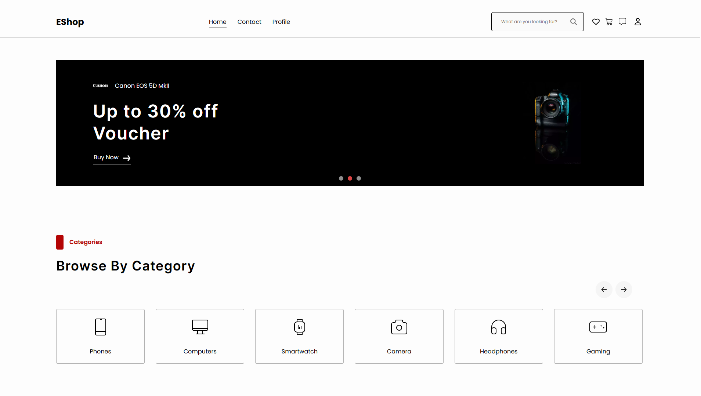

# EShop - Full-Stack E-commerce Platform


_Replace the link above with a screenshot or GIF demo of your project._

## 📖 Introduction

**EShop** is a full-stack, multi-role e-commerce platform built on a modern TypeScript stack. The project was engineered with a strong focus on scalability, high performance, and real-time user interaction, simulating a professional online marketplace.

This platform provides not only essential e-commerce functionalities but also integrates complex systems such as real-time chat, a robust order processing queue for flash sale events, and a secure payment gateway.

---

## ✨ Key Features

### 🔑 Core & Architecture
*   **Multi-Role Architecture:** A clear authorization system with distinct roles for **Admin**, **Seller**, and **Customer**.
*   **Secure Authentication:** Implements JSON Web Tokens (JWT) for authentication, complete with an **email verification** flow to ensure user security.
*   **RESTful API Design:** The entire backend is built following REST principles, making it easy to integrate and extend.
*   **Type-Safe Codebase:** The entire project is written in **TypeScript** from front to back, minimizing runtime errors and enhancing maintainability.

### 🚀 Performance & Real-Time
*   **High-Performance Order Queue:** Using **Redis** and **BullMQ**, the system can handle a high volume of concurrent orders, ensuring fairness and stability, especially during flash sale events.
*   **Real-Time Chat:** Users and sellers can communicate instantly through a chat system built with **WebSockets (Socket.IO)**.
*   **Automated Tasks (Cron Jobs):** Scheduled tasks, such as expiring verification tokens and cleaning up old messages, are automated with **cron jobs**, keeping the system efficient and clean.

### 🛒 User & Seller Features
*   **Product & Order Management:** A dedicated dashboard allows sellers to easily manage their products, track orders, and view sales statistics.
*   **Payment Gateway Integration:** Successfully integrated with the **MoMo payment gateway**, including webhook support for real-time transaction status updates.
*   **Comprehensive CRUD Functionality:** Full Create, Read, Update, and Delete operations are implemented for core modules like products, user profiles, and orders.

---

## 🛠️ Tech Stack

| Domain         | Technologies                                                           |
|----------------|------------------------------------------------------------------------|
| **Frontend**   | `React`, `TypeScript`, `Redux/Toolkit`, `SCSS`, `Socket.IO Client`         |
| **Backend**    | `Node.js`, `Express.js`, `TypeScript`, `Socket.IO`, `Redis`, `BullMQ`    |
| **Database**   | `PostgreSQL`, `Prisma ORM`                                             |
| **Tools & DevOps** | `Git`, `Docker`, `Nodemailer`, `JWT`                               |

---

## 🚀 Getting Started

### Prerequisites
*   Node.js (v18.x or later)
*   npm
*   PostgreSQL
*   Redis

### Installation

1.  **Clone the repository:**
    ```bash
    git clone https://github.com/HCMUS-HQHuy/EShop.git
    cd EShop
    ```

2.  **Setup the Backend:**
    ```bash
    cd server
    pnpm install
    cp .env.example .env 
    # Edit the environment variables in the .env file
    npx prisma migrate dev # Create the database schema
    ```

3.  **Setup the Frontend:**
    ```bash
    cd ../client
    pnpm install
    cp .env.example .env
    # Edit the environment variables in the .env file (e.g., backend URL)
    ```

### Running the Application

*   **Run the Backend Server:**
    ```bash
    cd server
    npm run dev
    ```

*   **Run the Frontend Client:**
    ```bash
    cd client
    npm run dev
    ```

Open your browser and navigate to `http://localhost:5173` (or your configured port).